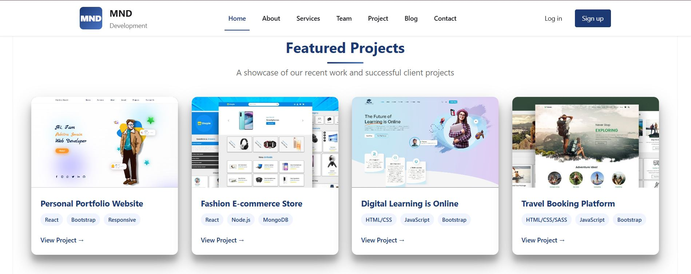
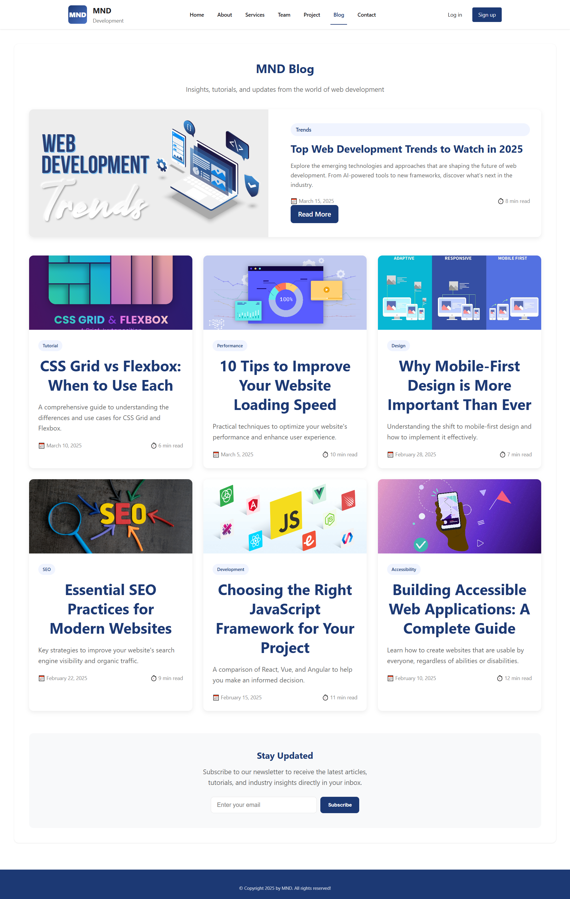

# MND



Hi 
# EVERYONE

# MND Development - **[LIVE DEMO](https://moonnightdevelopers.github.io/moonnightdeveloper/)**.
#

A modern, responsive contact page for MND Development with a fully mobile-responsive navbar and professional design.
Girls Hostel
## 🚀 Features


- **Fully Responsive Design** - Works perfectly on all devices (desktop, tablet, mobile)
- **Modern UI/UX** - Clean, professional design with smooth animations
- **Mobile-First Navigation** - Hamburger menu for mobile devices with smooth transitions
- **Contact Form** - Functional contact form with validation
- **Multiple Contact Methods** - Email, phone, location, and live chat options
- **Accessibility** - ARIA labels and keyboard navigation support
- **Performance Optimized** - Clean, efficient code with minimal dependencies

## 📱 Responsive Breakpoints

- **Desktop**: 1200px and above
- **Tablet**: 768px - 1199px
- **Mobile Large**: 576px - 767px
- **Mobile Small**: 480px - 575px
- **Mobile Extra Small**: Below 480px

## 🎨 Design System

### Color Palette
- **Primary Color**: `#1c3974` (Deep Blue)
- **Secondary Color**: `#4a74c7` (Light Blue)
- **Accent Color**: `#f8f9fa` (Light Gray)
- **Text Color**: `#1C1B1F` (Dark Gray)
- **Light Text**: `#717171` (Medium Gray)
- **White**: `#ffffff`

### Typography
- **Font Family**: Segoe UI, Tahoma, Geneva, Verdana, sans-serif
- **Font Weights**: 400 (Regular), 500 (Medium), 600 (Semi-bold), 700 (Bold)

## 🛠️ Technologies Used

- **HTML5** - Semantic markup
- **CSS3** - Modern styling with CSS Grid and Flexbox
- **JavaScript** - Interactive functionality
- **Font Awesome** - Icons (v6.4.0)

## 📁 Project Structure

```
mnd-contact-page/
│
├── index.html                 # Main HTML file
├── README.md                  # Project documentation
│
├── assets/                    # Additional assets (if any)
│   ├── images/               # Image files
│   └── fonts/                # Custom fonts
│
└── pages/                    # Additional pages (if expanded)
    ├── index.html            # Home page
    ├── about.html            # About page
    ├── services.html         # Services page
    ├── projects.html         # Projects page
    ├── blog.html             # Blog page
    └──  contact.html          # Contact page (current)
```

## 🚀 Installation & Setup

1. **Clone or Download** the project files
2. **Open** `index.html` in your web browser
3. **For development**:
   - Use a local server for best performance
   - Ensure all file paths are correct


# MND


## 📋 Usage

### Basic Usage
1. Open the `index.html` file in any modern web browser
2. The page will automatically adapt to your screen size
3. Use the navigation menu to explore different sections
4. Fill out the contact form to send a message

### Navigation
- **Desktop**: Horizontal navigation menu
- **Mobile**: Hamburger menu that transforms to X when active

### Contact Form
1. Fill in your full name
2. Provide your email address
3. Select a subject from the dropdown
4. Write your message
5. Click "Send Message" to submit

## 🔧 Customization

### Changing Colors
Update the CSS custom properties in the `:root` selector:

```css
:root {
    --primary-color: #your-color;
    --secondary-color: #your-color;
    /* ... other colors */
}
```

### Modifying Content
- Update company information in the contact section
- Change navigation links in both desktop and mobile nav sections
- Modify footer links and text

### Adding New Pages
1. Create new HTML files in the pages directory
2. Update navigation links in all pages
3. Ensure consistent styling across all pages

## 🌐 Browser Compatibility

- Chrome (Latest)
- Firefox (Latest)
- Safari (Latest)
- Edge (Latest)
- Mobile browsers (iOS Safari, Chrome Mobile)

## 📱 Mobile Features

- Touch-friendly interface
- Optimized tap targets (minimum 44px)
- Smooth scrolling
- Responsive images and icons
- Mobile-optimized form inputs

## 🎯 Performance Features

- Minimal HTTP requests
- Optimized CSS and JavaScript
- Efficient rendering with CSS Grid and Flexbox
- Lazy loading for images (if added)
- Clean, semantic HTML

## 🔍 SEO Considerations

- Semantic HTML structure
- Proper heading hierarchy
- Meta tags (add in head section)
- Alt text for images
- Mobile-friendly design

## 📞 Contact Information

**MND Development**
- **Email**: hello@mnddevelopment.com
- **Phone**: +91 7609050022
- **Address**: Srinivasa Nagar, Ameerpet Hyderabad, Telangana - 500016
- **Hours**: Monday-Friday, 9:00 AM - 6:00 PM

## 🛠️ Development Notes

### CSS Architecture
- Mobile-first responsive design
- CSS Custom Properties for theming
- BEM-like naming convention
- Modular component structure

### JavaScript Features
- Mobile navigation toggle
- Form validation
- Smooth animations
- Accessibility enhancements

### Accessibility Features
- ARIA labels for interactive elements
- Keyboard navigation support
- Color contrast compliance
- Semantic HTML structure

## 📈 Future Enhancements

- [ ] Backend integration for form submission
- [ ] Live chat functionality
- [ ] Dark mode toggle
- [ ] Multi-language support
- [ ] Advanced form validation
- [ ] Interactive map integration
- [ ] Social media links
- [ ] Blog integration
- [ ] E-commerce capabilities

## 🐛 Known Issues

- No known issues - all features tested and working
- Form currently uses alert for submission confirmation (can be enhanced with backend)

## 🤝 Contributing

1. Fork the project
2. Create your feature branch (`git checkout -b feature/AmazingFeature`)
3. Commit your changes (`git commit -m 'Add some AmazingFeature'`)
4. Push to the branch (`git push origin feature/AmazingFeature`)
5. Open a Pull Request

## 📄 License

This project is licensed under the MIT License - see the [LICENSE](LICENSE) file for details.

## 🙏 Acknowledgments

- Font Awesome for icons
- Modern CSS techniques and best practices
- Mobile-first design principles

## 📞 Support

If you have any questions or need support, please contact:
- **Email**: hello@mnddevelopment.com
- **Phone**: +91 7609050022

---

**Last Updated**: March 2025  
**Version**: 1.0.0  
**Developer**: MND Development Team
<!-- https://hikez-theme.myshopify.com/ -->
<!-- fully responsive in all devices like mobile phone tablet pc tablet pc desktop navbar only -->


Custom website development costs vary widely from ₹20,000 for a tailored small business site to several lakhs (₹2,00,000+) for complex platforms with unique features, depending on functionality (e-commerce, custom apps), design complexity, developer expertise (freelancer vs. agency), and ongoing maintenance needs. Expect basic custom sites to start around ₹20k-₹50k, while larger projects with integrations and unique design can easily cross ₹1 Lakh to ₹6 Lakhs or more. 
Cost Breakdown by Complexity & Type
Basic Custom Site (e.g., Portfolio, Brochure Site): ₹20,000 – ₹1,00,000+ (Tailored design, contact forms, blog).
Small/Medium Business Site: ₹80,000 – ₹2,00,000+ (More pages, testimonials, basic features).
E-commerce Sites: ₹1,50,000 – ₹4,00,000+ (Product catalogs, payment gateways, cart).
Complex/Web Apps: ₹50,000 – Several Lakhs (Custom functionality, integrations, extensive backend). 
Factors Influencing Price
Features & Functionality: E-commerce, user accounts, booking systems, custom tools add cost.
Design: Unique, highly interactive designs cost more than template-based ones.
Developer Choice: Freelancers are often cheaper than local agencies or international teams.
Technology Stack: Choice of CMS (WordPress, etc.) or custom coding impacts price.
Maintenance: Ongoing costs for security, updates, content, & support. 
Typical Cost Ranges (India Specific)
Freelancers: Can offer rates from ₹10,000 - ₹50,000+ for custom work, depending on complexity.
Agencies: Often start higher, offering comprehensive packages from ₹25,000 up to several lakhs for fully custom solutions. 
Key Takeaway: For a truly custom solution, expect significant investment beyond basic templates, with prices rising exponentially with unique features and advanced integrations. 


E-commerce solution pricing varies wildly, from free (open-source) to thousands of dollars, depending on platform (Shopify vs. custom), features (payment gateways, inventory), services (development, marketing), and scale, with monthly fees for platforms ($5-$300+) and significant upfront costs for custom builds or extensive services (starting ₹60k to ₹10 Lakhs+ in India). Expect costs for development (custom apps), platform subscriptions, digital marketing (SEO, ads), and ongoing support/maintenance. 
Typical Cost Structures
Platforms (Monthly/Annual Fees):
Hosted Platforms (Shopify, BigCommerce): Start from low monthly fees (e.g., $5-$300+) for basic to advanced features, plus transaction fees.
Open-Source (WooCommerce, Magento): Free software, but you pay for hosting, themes, plugins, and development.
Custom Development (One-Time/Project-Based):
Basic Store: Can start around ₹60,000 (approx. $700 USD) for simple setups in India.
Complex Stores (Apps, Integrations): Costs can easily reach ₹1,00,000 (approx. $1200 USD) or much more for complex features and custom work.
Services (Monthly/Project):
Digital Marketing: SEO, Social Media, Email campaigns often priced monthly (e.g., ₹6,000 - ₹50,000+/month) or per project/package.
Support & Maintenance: Monthly retainers or hourly rates for ongoing help. 
Key Factors Influencing Price
Platform Choice: Shopify, WooCommerce, Magento, or custom build.
Features Needed: Secure payments, inventory, CRM, personalization, multi-vendor, etc..
Design: Basic template vs. fully custom, unique design.
Marketing & SEO: Driving traffic is crucial and adds significant cost.
Scale: Small business vs. large enterprise needs. 
Example Indian Market Prices (from IndiaMART)
E-commerce Software Dev: ₹3,000 - ₹10,000+/month.
E-commerce Solutions (Services): ₹25,000 - ₹50,000+/month or per project.
Website/App Development: ₹80,000+ per project. 


Web application development costs vary widely, from a few hundred dollars for simple projects to tens of thousands or more for complex enterprise solutions, typically ranging from $5,000 to $200,000+, depending on complexity, features (like AI/ML), team location (US developers cost more than India/Latin America), and project size. Basic apps start around $12k-$40k, mid-range apps $50k-$150k, while complex SaaS or B2B apps can exceed $150k, with factors like UI/UX, backend, integrations, and ongoing maintenance also affecting price. 
Cost by Project Complexity
Basic/MVP Apps: $5,000 - $40,000 (e.g., portfolio sites, simple catalogs).
Mid-Level Apps: $50,000 - $150,000 (e.g., complex e-commerce, HR systems, social media apps).
Complex/Enterprise Apps: $150,000+ (e.g., B2B SaaS, business process automation, AI/ML integration). 
Key Factors Influencing Price
Functionality & Features: More custom features, complex logic, and integrations (payment gateways, CRMs) increase cost.
Developer Location: Hourly rates differ significantly (e.g., North America is higher than Latin America).
Project Size & Timeline: Larger projects take more time and resources, increasing costs.
Technology Stack: Modern frameworks (React, Angular) and unique tech can influence pricing.
Team Experience: Experienced agencies often charge more but deliver better quality, reducing future costs.
Post-Launch: Hosting, security (GDPR/CCPA), and ongoing maintenance add to total cost. 
Example Pricing (India-Specific)
Basic Projects: Can start from ₹10,000 - ₹50,000.
Custom Apps: ₹50,000 to several lakhs, depending heavily on features. 
In summary, expect a significant investment for robust web apps, with costs driven by unique features, team expertise, and geographical location, say Simform and eSparkBiz. 


UI/UX design service costs vary wildly, from $25-$150/hour for freelancers to $100-$250+/hour for agencies, with project-based pricing ranging from $2,000 for simple sites to $100,000+ for complex apps/platforms, depending heavily on complexity, research depth, team expertise, and revisions, with basic mobile apps starting around $5k-$10k and advanced ones costing $20k-$80k+. 
By Service Provider
Freelancers: $25 - $150 per hour (or $30-$70/hour for mobile apps).
Small Studios/Agencies: $5,000 - $25,000+ for small projects; $20,000 - $100,000+ for larger efforts.
High-End Agencies/Enterprise: Can exceed $100,000+. 
By Project Type (Examples)
Basic Website (5-8 pages): $2,500 - $8,000.
Simple Mobile App: $5,000 - $10,000 (basic) to $12,000+ (simple).
Feature-Rich/Complex App: $25,000 - $50,000+.
Enterprise Portal/Large Platform: $25,000 - $150,000+. 
Key Factors Influencing Cost
Scope: Number of screens, user flows, features.
Research: Depth of user research (personas, journeys, testing).
Complexity: Custom animations, branding, data visualization.
Platform: Web, iOS, Android, or cross-platform.
Revisions: More iterations increase costs significantly.
Expertise: Seniority and specialization of the design team. 
Pricing Models
Hourly Billing: Best for ongoing or undefined scope.
Fixed Project Fee: Good for clearly defined projects.
Monthly Retainer: For continuous design support. 


Website maintenance costs vary widely, from ₹2,500/month for small sites to ₹50,000+/month for large enterprises, depending on complexity, updates, security, and hosting; typically, expect basic blogs around ₹5k-₹15k/year, WordPress business sites ₹5k-₹10k/month, and e-commerce stores ₹10k-₹40k+/month, covering essential tasks like backups, updates, security, and performance.  
Cost Breakdown by Site Type (Monthly/Annual Estimates)
Small Sites (Blogs/Portfolios): ₹2,500 - ₹10,000/month or ₹5,000 - ₹15,000/year for basic upkeep. 
Medium/Business Sites: ₹5,000 - ₹12,000/month or ₹15,000 - ₹35,000/year for more pages and features. 
E-commerce/Corporate: ₹15,000 - ₹40,000+/month for integrations, higher traffic, and security. 
Large Enterprises/Custom Apps: ₹25,000 - ₹50,000+/month for high traffic, custom features, and dedicated support. 
Key Factors Influencing Cost
Website Size & Complexity: More pages, custom code, and features (like payment gateways) increase costs. 
Platform: WordPress sites have specific plugin/theme update needs, affecting price.
Security Needs: Higher security (SSL, vulnerability scans) adds to costs. 
Hosting: Shared hosting is cheap ($5/mo), but large sites need pricier dedicated servers. 
Content Updates: Frequency of new content/blog posts affects effort. 
Typical Services Included
Security: Malware scans, backups, security patches.
Updates: Core, theme, and plugin updates (WordPress).
Performance: Speed optimization, uptime monitoring.
Support: Bug fixes, minor content changes. 


Website template service prices vary widely from free to thousands of dollars, depending on if you buy a pre-made template ($20-$100+) or hire someone to customize one, ranging from basic setups (₹5k-₹15k) to complex, custom designs (₹1L+) for full-service development, with hourly rates for designers often starting around ₹400-₹700/hour. You'll pay less for a DIY template and more for professional setup, customization, and features. 
Factors Influencing Price:
Template Type: Free (e.g., HTML5 UP) vs. Premium (e.g., TemplateMonster, Webflow, Envato, ThemeForest).
Customization: Simple tweaks vs. full redesign, adding features (e-commerce, forms).
Service Provider: Freelancer vs. Agency.
Platform: WordPress, Shopify, custom HTML/CSS.
Complexity: A simple 5-page site vs. a large business portal. 
Typical Price Ranges:
DIY/Basic:
Free: Many high-quality, free templates available for basic use (e.g., HTML5 UP).
Premium Templates: $20 - $100+ for a one-time purchase on marketplaces like TemplateMonster, Webflow.
Professional Setup/Customization (using templates):
Basic Service: ₹5,000 - ₹15,000 for a 5-page site (often involves using a template).
Hourly Rates: ₹400 - ₹700+ per hour for template customization services.
Packages: ₹2,000 - ₹1,00,000+ for more comprehensive design and setup.
Full Custom Design (beyond templates):
Simple informational site: ₹10,000 - ₹50,000.
Professional business site (10-20 pages): ₹80,000 - ₹1,50,000+. 
Where to Find Services:
Template Marketplaces: Envato, ThemeForest, TemplateMonster.
Service Providers: IndiaMART (for various local providers).
Design Platforms: Nicepage (for pricing templates). 


The list price is the initial or advertised price of a product before any discounts, taxes, or additional fees are applied. The total price is the final amount the customer actually pays, which includes all relevant adjustments. 
List Price
The list price, also known as the Manufacturer's Suggested Retail Price (MSRP) or catalog price, is a baseline price set by the manufacturer or seller. It's used as a starting point for transactions and negotiations and helps communicate the product's general value to consumers. 
Total Price
The total price (sometimes called the net price or sales price) is the actual cost to the buyer at the completion of a purchase. It is calculated by taking the list price and factoring in all other pricing elements. 
To calculate the total price from the list price, you must account for the following factors:
Discounts: Subtract any trade discounts, promotions, or coupons from the list price.
Quantity: The total price for multiple items is the unit price multiplied by the number of units purchased.
Taxes: Add applicable sales taxes, Goods and Services Tax (GST), or value-added taxes (VAT).
Fees: Include any additional fixed or variable charges, such as shipping, handling, installation, or recycling fees. 
The general formula is:
Total Price = (List Price - Discounts) + Taxes + Additional Fees
When entering a list price in a system or transaction, it serves as the foundation upon which all these other calculations build to arrive at the final, total price the customer will be charged. 